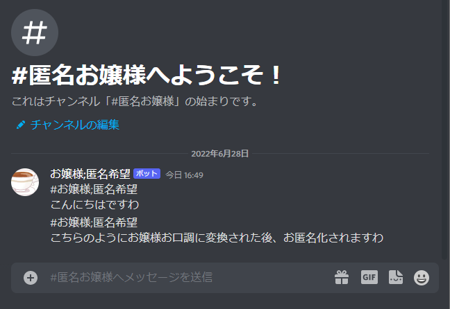
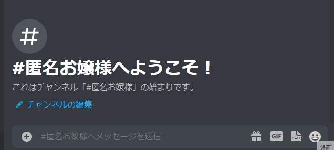

[](https://discord.gg/9JzDyKYyX8)   
# 🫖匿名希望お嬢様Bot
匿名希望お嬢様Botは[ojosama](https://github.com/jiro4989/ojosama)を利用したお嬢様口調の匿名サロンを実現しますわ!!



# ⚠️ワーニング
**[注意事項](#%EF%B8%8F注意事項)を必ずお読みいただき、同意した上でお使いください。**  
注意事項に違反した使い方は製作者の意図した使い方ではなく、発生した損害・法的責任は利用者が責任を追うものとします。  
また違法性のある投稿は禁止です。ログを残していますのでご了承ください。   

# 📨稼働中のクラウド版
[招待](https://discord.com/oauth2/authorize?client_id=821662757794349066&permissions=11264&scope=bot)

# 📒使い方
Discordサーバーに匿名希望お嬢様Botを導入して、「匿名お嬢様」というチャンネルを作ってください。  
そのチャンネルに送信すると、自分の送信が消去された後、お嬢様口調に変換されたものが送信されます。



# ✅特徴
* お嬢様口調に自動変換されるDiscordチャンネルを用意できる
* 疑似的な匿名化。みな平等にお嬢様ですわ!!

# 🏗オンプレ版Quick strat

## 構築方法(推奨方法)

```bash
git clone https://github.com/PenguinCabinet/Anonymous-ojosama-bot
cd Anonymous-ojosama-bot
vim docker-compose-example.yml 
# docker-compose-example.ymlの環境変数のBOT_KEYに開発者ページで作成したDiscord BotのKeyを入力してください
#もしくはホストOS上で"export ano_ojosama_bot=<your discord bot key>"を実行します
docker-compose -f docker-compose-example.yml up -d
```

## 構築方法(ほかのやりかた)

自前でビルドするため、時間がかかります

```bash
git clone https://github.com/PenguinCabinet/Anonymous-ojosama-bot
cd Anonymous-ojosama-bot
vim docker-compose.yml 
# docker-compose.ymlの環境変数のBOT_KEYに開発者ページで作成したDiscord BotのKeyを入力してください
#もしくはホストOS上で"export ano_ojosama_bot=<your discord bot key>"を実行します
docker-compose up -d
```

## Botの作成

[Discordの開発者ページ](http://discord.com/developers/)にアクセスしてBotを作成したのち、「匿名希望お嬢様Bot」に適切な権限を与えてください
```markdown
「匿名希望お嬢様Bot」に必要な権限
* メッセージを読む
* メッセージの履歴を読む
* メッセージのマネジメント
```

# ✍使用したソフトウェア
* [ojosama](https://github.com/jiro4989/ojosama)

# ⚠️注意事項
[ojosama](https://github.com/jiro4989/ojosama)を使用しているため、以下の注意事項を守って使ってください。

## 5.2. プログラムの使用について
壱百満天原サロメお嬢様、及びその所属の にじさんじ や、 その関係者、ファンコミュニティの方の迷惑にならないように使ってください。   

本プログラムは、にじさんじ所属の壱百満天原サロメお嬢様のキャラクターを題材にした二次創作の一つです。 故に、本プログラムは以下二次創作ガイドラインに従います。   
   
[ANYCOLOR二次創作ガイドライン](https://event.nijisanji.app/guidelines/)   
     
本プログラムを使う場合も上記ガイドラインを守ってお使いください。   
